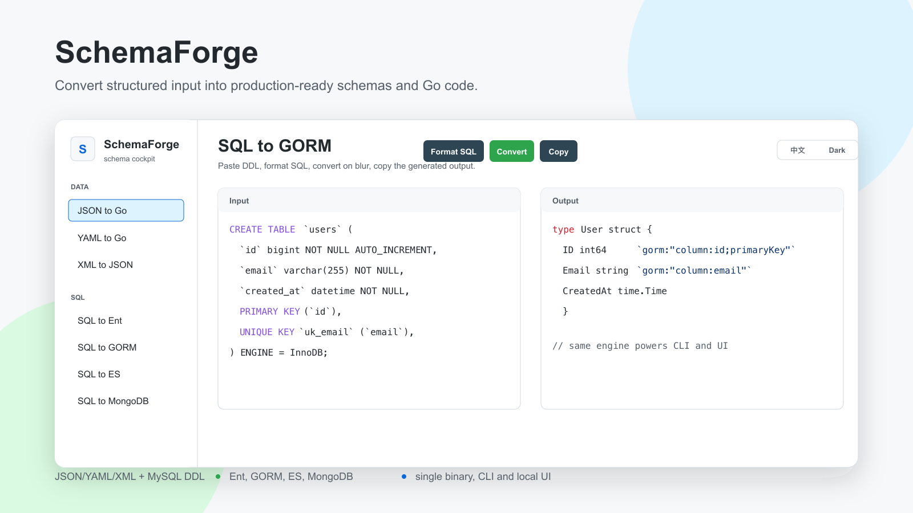

# SchemaForge



SchemaForge is a tiny open-source workbench that turns structured text into schemas and Go code. It ships as one Go binary with both CLI commands and a built-in local UI.

> First release scope: structural conversion only. SchemaForge does not connect to databases or execute SQL.

## Features

- JSON sample to Go struct
- YAML sample to Go struct
- XML document to JSON
- MySQL `CREATE TABLE` to Ent schema
- MySQL `CREATE TABLE` to GORM model
- MySQL `CREATE TABLE` to Elasticsearch mapping
- MySQL `CREATE TABLE` to MongoDB JSON Schema validator
- Local UI with GitHub-like light colors by default
- Built-in light/dark theme switch
- SQL formatting in SQL conversion modes

## Install

```bash
go install github.com/schemaforge/schemaforge/cmd/schemaforge@latest
```

Homebrew support is planned for releases:

```bash
brew tap schemaforge/tap
brew install schemaforge
```

## Docker

Run the local UI in a container:

```bash
docker build -t schemaforge .
docker run --rm -p 8989:8989 schemaforge
```

Use the CLI through Docker:

```bash
docker run --rm -i schemaforge convert json-go < user.json
```

## Quick Start

```bash
schemaforge convert json-go -i user.json
schemaforge convert sql-ent -i schema.sql -o user_schema.go
schemaforge convert sql-gorm -i schema.sql
schemaforge convert sql-es -i schema.sql
schemaforge convert sql-mongo -i schema.sql
schemaforge convert yaml-go -i config.yaml
schemaforge convert xml-json -i payload.xml
schemaforge ui --port 8989
```

You can also pipe input through stdin:

```bash
echo '{"id":1,"name":"Ada"}' | schemaforge convert json-go
```

## CLI Modes

| Mode | Input | Output |
| --- | --- | --- |
| `json-go` | JSON object sample | Go struct |
| `yaml-go` | YAML object sample | Go struct |
| `xml-json` | XML document | JSON document |
| `sql-ent` | MySQL DDL | Ent schema code |
| `sql-gorm` | MySQL DDL | GORM model code |
| `sql-es` | MySQL DDL | Elasticsearch mapping JSON |
| `sql-mongo` | MySQL DDL | MongoDB JSON Schema validator |

## Limitations

- SQL support is focused on MySQL `CREATE TABLE` DDL.
- Query SQL, triggers, stored procedures, views, and database connections are out of scope for the first release.
- The built-in YAML parser intentionally supports common flat object samples first. Nested YAML support can be added without changing the public API.
- Generated code is a starting point. Review naming, indexes, and domain-specific field choices before shipping it.

## Development

```bash
go test ./internal/convert ./internal/server
go run ./cmd/schemaforge convert json-go -i example/user.json
go run ./cmd/schemaforge ui --port 8989
```

## Release Notes

SchemaForge is designed for single-binary releases. The included `.goreleaser.yaml` can build archives and publish a Homebrew formula once the GitHub repository and tap are created.

## License

MIT
