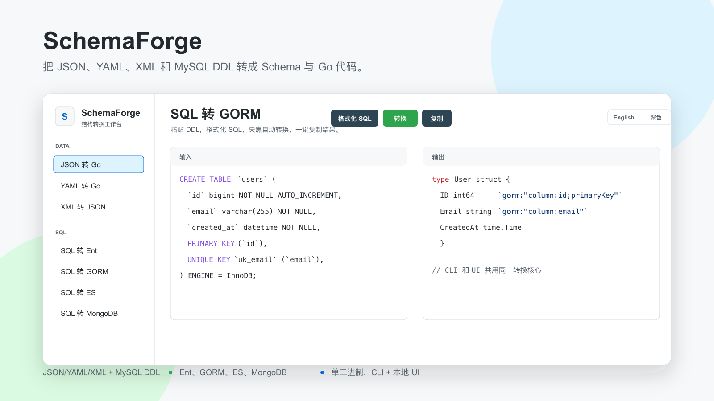

# SchemaForge



SchemaForge 是一个开源结构转换工作台，用一个 Go 二进制同时提供 CLI 命令和本地 Web UI，把结构化文本转换成 Schema 或 Go 代码。

> 首版只做结构转换，不连接数据库，不执行 SQL。

## 功能

- JSON 样例转 Go struct
- YAML 样例转 Go struct
- XML 文档转 JSON
- MySQL `CREATE TABLE` 转 Ent schema
- MySQL `CREATE TABLE` 转 GORM model
- MySQL `CREATE TABLE` 转 Elasticsearch mapping
- MySQL `CREATE TABLE` 转 MongoDB JSON Schema validator
- 默认 GitHub Light 风格本地 UI，和 CLI 共用同一套转换核心
- 支持明暗主题切换
- SQL 转换模式支持 SQL 输入格式化

## 安装

```bash
go install github.com/why19970628/schemaforge/cmd/schemaforge@latest
```

发布版本创建后，也可以从 GitHub Releases 下载预编译二进制：

https://github.com/why19970628/schemaforge/releases

## Docker

用容器运行本地 UI：

```bash
docker build -t schemaforge .
docker run --rm -p 8989:8989 schemaforge
```

通过 Docker 使用 CLI：

```bash
docker run --rm -i schemaforge convert json-go < user.json
```

## 快速开始

```bash
schemaforge convert json-go -i user.json
schemaforge convert json-diff -i before.json --right after.json --format unified
schemaforge convert sql-ent -i schema.sql -o user_schema.go
schemaforge convert sql-gorm -i schema.sql
schemaforge convert sql-es -i schema.sql
schemaforge convert sql-mongo -i schema.sql
schemaforge convert yaml-go -i config.yaml
schemaforge convert xml-json -i payload.xml
schemaforge ui --port 8989
```

也支持从 stdin 读取：

```bash
echo '{"id":1,"name":"Ada"}' | schemaforge convert json-go
```

## CLI 模式

| 模式 | 输入 | 输出 |
| --- | --- | --- |
| `json-go` | JSON object 样例 | Go struct |
| `json-diff` | 两份 JSON 文档 | 结构化差异或 Git Diff 风格差异 |
| `yaml-go` | YAML object 样例 | Go struct |
| `xml-json` | XML 文档 | JSON 文档 |
| `sql-ent` | MySQL DDL | Ent schema 代码 |
| `sql-gorm` | MySQL DDL | GORM model 代码 |
| `sql-es` | MySQL DDL | Elasticsearch mapping JSON |
| `sql-mongo` | MySQL DDL | MongoDB JSON Schema validator |

## 限制

- SQL 首版主要支持 MySQL `CREATE TABLE` DDL。
- 查询 SQL、触发器、存储过程、视图、数据库连接暂不支持。
- 内置 YAML 解析器优先支持常见扁平对象样例；后续可以在不改 API 的前提下增强嵌套 YAML。
- 生成代码是起点，落地前建议检查命名、索引和业务字段语义。

## 开发

```bash
cd web && npm ci && npm run build
cd ..
go test ./internal/convert ./internal/server
go run ./cmd/schemaforge convert json-go -i example/user.json
go run ./cmd/schemaforge ui --port 8989
```

本地 UI 使用 Vue 3、Vite、Element Plus 和 CodeMirror 构建，生产构建产物会嵌入 Go 二进制。

## 发布

SchemaForge 以单二进制发布为目标。仓库中的 `.goreleaser.yaml` 可在 GitHub 仓库和 Homebrew tap 准备好后用于构建归档和发布 formula。

## License

MIT
